# Tugas Praktikum 3 (Pertemuan ke 10) 


|**Nama**|**NIM**|**Kelas**|**Mata Kuliah**|
|----|---|-----|------|
|**Radityatama Nugraha**|**312310644**|**TI.23.A6**|**Basis Data**|

# SQL Constraint
### -SQL Constraint digunakan untuk menentukan aturan untuk data dalam tabel.
### -Constraint digunakan untuk membatasi jenis data yang bisa masuk ke tabel. Ini memastikan keakuratan dan keandalan data dalam tabel.
### -Constraint dapat berupa level kolom atau level tabel.
### -Constraint level kolom berlaku untuk kolom, dan batasan level tabel berlaku untuk seluruh tabel.

# Tugas Praktikum
### -Implementasikan penggunaan CONSTRAINT FOREIGN KEY pada semua tabel yang berelasi.
### -yang perlu diperhatikan:
    tipe data pada field yang berelasi harus sama termasuk juga ukuran datanya.
    misal: pada tabel dosen, kd_ds VARCHAR(10) maka tabel yang merujuk yaitu tabel mahasiswa, kd_ds juga harus bertipe VARCHAR(10).
## 1. Lakukan penambahan data pada tabel mahasiswa dengan mengisi kd_ds yang belum ada pada data dosen.
## 2. Hapus satu record data pada tabel dosen yang telah dirujuk pada tabel mahasiswa.
## 3. Ubah mode menjadi ON UPDATE CASCADE ON DELETE RESTRICT
## 4. Lakukan perubahan data pada tabel dosen (kd_ds)
## 5. Lakukan penghapusan data pada tabel dosen
## 6. Ubah mode menjadi ON UPDATE CASCADE ON DELETE SET NULL
## 7. Lakukan penghapusan data pada tabel dosen


# 1. Lakukan penambahan data pada tabel mahasiswa dengan mengisi kd_ds yang belum ada pada data dosen.
### dengan menggunakan kode berikut:
```
INSERT INTO dosen (kd_ds, nama) VALUES
('101', 'Yoga'),
('102', 'Akbil'),
('103', 'Akbar'),
('104', 'Wasis'),
('105', 'Romi');
```

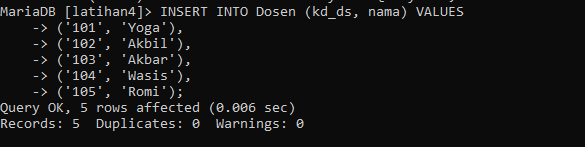

### output nya:

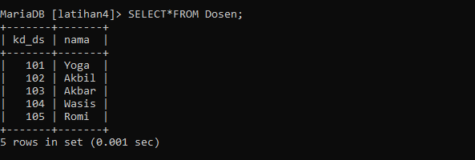

# 2. Hapus satu record data pada tabel dosen yang telah dirujuk pada tabel mahasiswa.
```
  DELETE FROM dosen WHERE kd_ds = '102';
```

### output nya:

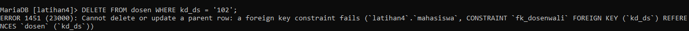

### output eror. Jika Anda ingin menghapus record dari tabel "dosen" yang memiliki referensi dari tabel "mahasiswa", Anda dapat menggunakan opsi ON DELETE CASCADE pada konstrain kunci asing untuk melakukan penghapusan secara otomatis dari tabel "mahasiswa" saat record dihapus dari tabel "dosen".

### Berikut adalah perbaikan yang perlu dilakukan pada konstrain kunci asing fk_dosenwali di tabel "mahasiswa":
```
ALTER TABLE mahasiswa DROP  
    FOREIGN KEY fk_dosenwali;
```

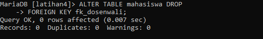

```
ALTER TABLE mahasiswa
ADD CONSTRAINT fk_dosenwali
FOREIGN KEY (kd_ds)
REFERENCES dosen (kd_ds)
ON DELETE CASCADE;
```

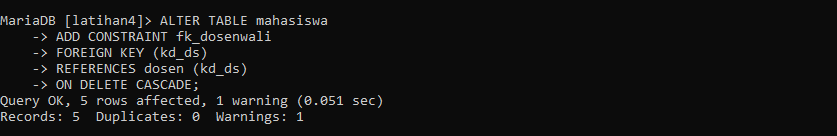

### Dengan perubahan gambar di atas, ketika Anda menghapus record dari tabel "dosen" yang memiliki referensi di tabel "mahasiswa", record terkait dalam tabel "mahasiswa" juga akan secara otomatis dihapus

### Setelah menjalankan perintah di atas, Anda dapat kembali mencoba menghapus record dengan menggunakan perintah berikut:
```
DELETE FROM dosen WHERE kd_ds = '102';
```


### output nya:

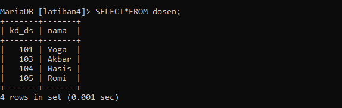

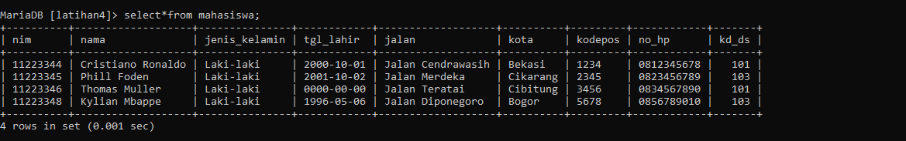

# 3. Ubah mode menjadi ON UPDATE CASCADE ON DELETE RESTRICT Untuk mengubah konstrain kunci asing menjadi ON UPDATE CASCADE dan ON DELETE RESTRICT, Anda perlu menghapus konstrain kunci asing yang ada dan menambahkan konstrain baru dengan opsi yang diinginkan. Berikut adalah langkah-langkahnya:

### Hapus konstrain kunci asing yang ada pada tabel "mahasiswa":
```
ALTER TABLE mahasiswa
DROP FOREIGN KEY fk_dosenwali;
```

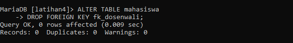

```
ALTER TABLE mahasiswa
ADD CONSTRAINT fk_dosenwali
FOREIGN KEY (kd_ds)
REFERENCES dosen (kd_ds)
ON UPDATE CASCADE
ON DELETE RESTRICT;
```
### Tambahkan kembali konstrain kunci asing dengan opsi ON UPDATE CASCADE dan ON DELETE RESTRICT:

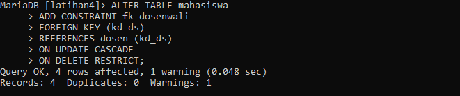

# 4. Lakukan perubahan data pada tabel dosen (kd_ds)

### Berikut adalah contoh perintah untuk melakukan perubahan data pada tabel "dosen" dengan kolom "kd_ds":
```
UPDATE dosen
SET kd_ds = '106'
WHERE kd_ds = '101';
```

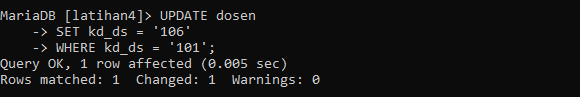

### Perintah di atas akan mengubah nilai kolom "kd_ds" dari "DS001" menjadi "DS006" pada tabel "dosen". Anda dapat menyesuaikan nilai yang ingin Anda ubah dan kondisi WHERE sesuai dengan kebutuhan Anda.

### Pastikan untuk menjalankan perintah dengan hati-hati dan memastikan bahwa perubahan data yang Anda lakukan sesuai dengan kebutuhan dan kebijakan yang berlaku dalam basis data Anda.

### output:

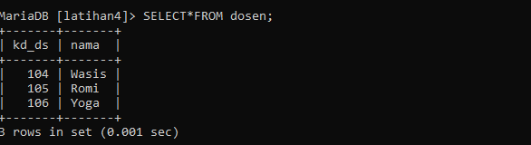

# 5. Lakukan penghapusan data pada tabel dosen

Untuk menghapus data dari tabel "dosen" dengan kondisi "kd_ds = 'DS003'", Anda dapat menggunakan perintah DELETE dengan sintaks yang benar. Berikut adalah contoh perintah yang dapat Anda gunakan:
```
DELETE FROM dosen
WHERE kd_ds = '102';
```

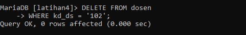

# 6. Ubah mode menjadi ON UPDATE CASCADE ON DELETE SET NULL
```
ALTER TABLE mahasiswa
DROP FOREIGN KEY fk_dosenwali;
```

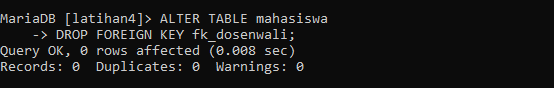

```
ALTER TABLE mahasiswa
ADD CONSTRAINT fk_dosenwali
FOREIGN KEY (kd_ds)
REFERENCES dosen (kd_ds)
ON DELETE SET NULL;
```

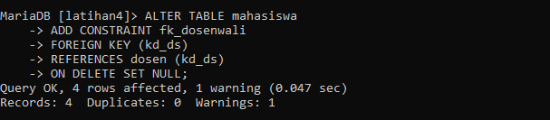

### Dengan perubahan di atas, ketika Anda menghapus record dari tabel "dosen" yang memiliki referensi di tabel "mahasiswa", nilai kolom "kd_ds" dalam tabel "mahasiswa" yang mengacu pada record yang dihapus akan diatur menjadi NULL.

### Setelah menjalankan perintah di atas, Anda dapat kembali mencoba menghapus record dengan menggunakan perintah berikut:

# 7. Lakukan penghapusan data pada tabel dosen

```
DELETE FROM dosen WHERE kd_ds = '103';
```


 ### Perintah ini akan menghapus record dengan nilai "102" dari tabel "dosen", dan karena menggunakan opsi ON DELETE SET NULL, nilai kolom "kd_ds" dalam tabel "mahasiswa" yang mengacu pada record yang dihapus akan diatur menjadi NULL.

 # Evaluasi dan Pertanyaan
 
### -Tulis semua perintah-perintah SQL percobaan di atas beserta outputnya!

### -Apa bedanya penggunaan RESTRICT dan penggunaan CASCADE

### a. RESTRICT : ketika menggunakan opsi RESTRICT dalam keterkatian, aturan keterkaitan akan membatasi aksi yang dapat dilakukan pada data yang terkait. Jika ada aksi yang menyebabkan konflik atau melanggar aturan keterkaitan. RESTRICT akan mencegaah aksi tersebut dilakukan. Misalnya, jika ada keterkaitan antara Tabel A dan Tabel B, dan kita mencoba untuk menghapus baris dari Tabel A yang memiliki keterkaitan dengan Tabel B, RESTRICT akan mencegah penghapusan tersebut jika ada baris yang masih terkait dalam Tabel B. Dengan menggunakan RESTRICT, aksi yang melanggar keterkaitan akan ditolak.

### b. CASCADE : ketika menggunakan opsi CASCADE dalam keterkaitan, aturan keterkaitan akan menyebabkan aksi yang dilakukan pada satu tabel juga mempengaruhi tabel yang terkait. Jadi, jika ada aksi yang dilakukan pada tabel yang memiliki ketertakitan dengan tabel lain, CASCADE akan mengakibatkan aksi tersebut juga berdampak pada tabel yang terkait. Misalnya, jika ada keterkaitan antara Tabel A dan Tabel B, dan kita menghapus baris dari Tabel A, CASCADE akan menghapus semua baris yang terkait dengan Tabel B secara otomatis. Dengan menggunakan CASCADE, aksi yang dilakukkan pada satu tabel akan menyebabkan kaskade aksi pada tabel yang terkait.

# -Berikan kesimpulan anda!

### SQL Constraint digunakan untuk menentukan aturan untuk data dalam tabel.

### Constraint digunakan untuk membatasi jenis data yang bisa masuk ke tabel. Ini memastikan keakuratan dan keandalan data dalam tabel.

### Constraint dapat berupa level kolom atau level tabel.

### Constraint level kolom berlaku untuk kolom, dan batasan level tabel berlaku untuk seluruh tabel.

### RESTRICT : RESTRICT membatasi aksi yang melanggar keterkaitan antara tabel. CASCADE : CASCADE mempengaruhi tabel yang terkait dengan aksi yang dilakukan pada tabel utama. Keitka memilih antara RESTRICT dan CASCADE, pertimbangkan tujuan dan kebutuhan skema basis data yang sedang Anda bangun. RESTRICT cocok jika Anda ingin menerapkan pembatasan yang ketat pada aksi yang melanggar keterkaitan, sementara CASCADE memungkinkan aksi pada satu tabel juga berdampak pada tabel terkait.


